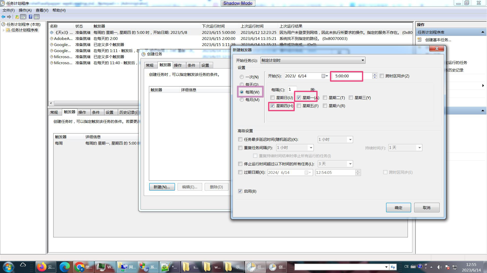

# Windows定期更换桌面背景程序
## 简介
本程序用于时间管理。

不少工作人士以固定周期推进任务，以实现自己的目标。我大约每3天会做一次小结。希望某种东西能够反映/形象化这种时间节律，以强化大脑对计划周期的感觉/印象。

运行本程序后会更换Windows桌面壁纸。配合Windows系统的【计划任务】，我每周一、周四自动更改Windows桌面壁纸（即为每个周期绑定一张图片），提示新的计划周期开始了。

## 用法
### 设置-脚本
 首先需要允许Windows执行powershell脚本(本程序为powershell脚本)。参照此文设置：<https://www.jianshu.com/p/4eaad2163567>
 
1. 下载 
  将脚本文件 [`set-random-wallpapper.ps1`](./set-random-wallpapper.ps1) 保存到自己电脑。
2. 设置目录位置 
  请准备你的若干背景图片，假如位于 `d:/bg/`目录。在`set-random-wallpapper.ps1`文件中找到此行： 
  `$bg_dir= "c:\Users\Public\Pictures"` 
  修改为： 
  `$bg_dir= "d:/bg/"`
3. 测试 
  右键点击`set-random-wallpapper.ps1`，执行“使用powershell运行”。这时桌面就手动更换了。设置为壁纸的图片将以当天日期重命名，且移动到`d:/bg/__2023/`目录（即2023年的所有图片可在`d:/bg/__2023/`下找到）。
  
### 设置-Windows【计划任务】
为了定期更换桌面壁纸，需要设置windows【计划任务】。windows【计划任务】可定期运行程序。

1. 打开计划任务程序：[控制面板]->[系统和安全]->[管理工具]->[计划任务] 
  或：使用快捷键 `Windows`+`R` 调出“运行”命令，在其中输入 `taskschd.msc`，回车。
  # 
  
  
2. 创建任务：
 
 
3. 为新任务取个名字：
  
  
4. 操作设置： 
   在“程序或脚本”栏，输入：`powershell` 
   在“添加参数()可选”栏，输入此脚本在你电脑上的完整路径。例如： `d:/set-random-wallpapper.ps1`
  
  
5. 触发器设置:  
  这里我设置为每周一、周四5点钟触发（运行程序），仅作参考。你应该设置为自己的计划周期
  
  
6. 勾选“如果过了计划开始时间，立即启动”： 
(如果设置是早上5点更换壁纸，可是电脑关机/休眠中。那么重新登录系统后，照样更换壁纸。此选项有延迟，登录系统约10分钟后执行。)

7. 设置完毕后，点击[确定]，以保存：

8. 查看或修改: 若参数配置有误，后续可以点开设置的计划任务，以查看、修改：

-------完--------
